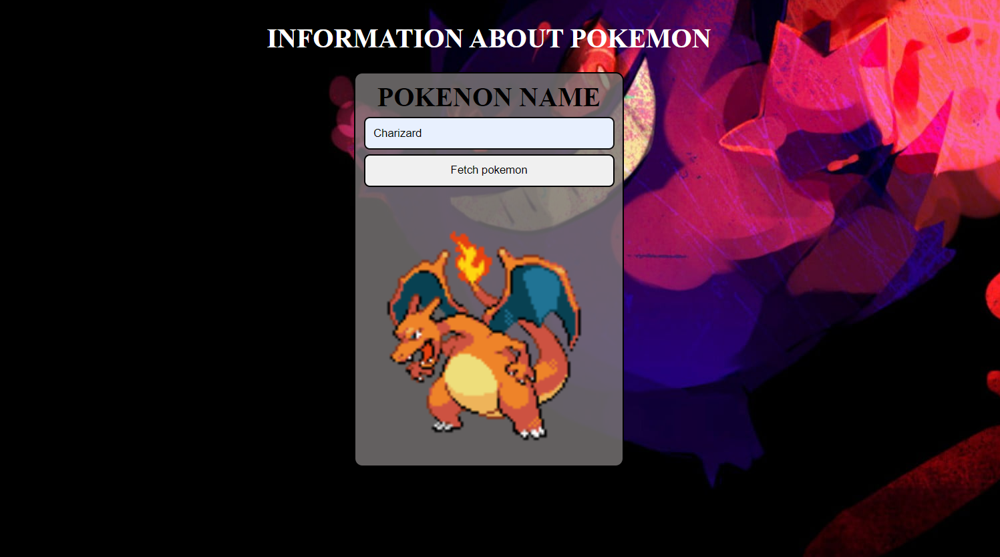

# Pokemon-API
## 👋 Hi i am Rahul

I'm excited to share my latest project: a Pokémon Fetch API Website, designed to provide detailed information on Pokémon through a user-friendly interface.

🔍 Key Features:
Search Functionality:       🔎 Quickly find any Pokémon by name or ID.
Comprehensive Information:  📋 Access detailed profiles, including types, abilities, and stats.
Responsive Design:          📱💻 Optimized for seamless use across all devices.
Random Pokémon Generator:   🎲 Easily discover new Pokémon with a single click.

This project showcases my skills in web development and API integration. I would love to hear your feedback!
